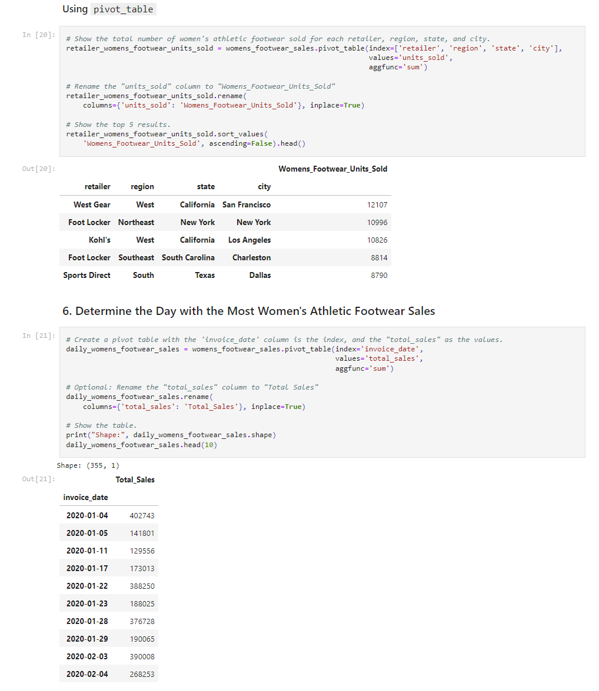

# athletic_sales_analysis

## Description
This challenge focuses on examining athletic sales data to understand which U.S. cities have sold the most athletic wear over the past two years. The analysis includes merging sales data from 2020 and 2021, identifying which regions and retailers had the highest sales. We are also looking into the sales of women's athletic footwear on a daily and weekly basis.

## Table of Contents
- [Usage](#usage)
- [Credits](#credits)
- [Screenshot](#screenshot)

## Usage
> **To use...**  
1. Clone the repository to your local system using `git clone`
2. Open the `wholesale_data_analysis_starter_code.ipynb` file using Jupyter Labs
3. Then explore, transform, and analyze the data using the pandas library

## Credits
Starter code for this assignment was provided by [edX bootcamp](https://www.edx.org/boot-camps).

## Screenshot
>**Notebook Preview...**

  
 

